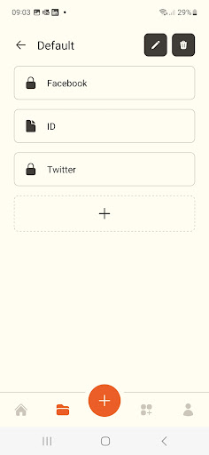

# **:lock: Heslo**

Your personal vault for your passwords and files.
Developed with React Native, this project show some of my skills in the mobile development.

## :heavy_check_mark: Features

- Login and register using the OPAQUE protocol
- File upload via presigned urls.
- Passwords / File urls encryption

## :art: Layout

<div style="display: flex; justify-content: center; width: 100%;">
    
    
    
    
    
</div>

## **:wrench: Technologies**

- React Native
- React Navigation
- OPAQUE protocol
- Aes265
- Zod
- Unform

## :books: How to use

```sh
# Install dependencies

$ yarn


# Run the dev comman

$ yarn dev
```

## :open_book: How to contribute

1. Make a **fork**.

2. Make a new branch with your changes: `git checkout -b my-feature`

3. Save your changes and make a commit with a cool message: `git commit -m "feat: My new feature"`

4. Send your changes: `git push origin my-feature`

> If a question persists, see [how to contribute in GitHub](https://github.com/firstcontributions/first-contributions)

## :memo: License

This project is under the **MIT License**. See [LICENSE][license] to know more.

---

<h4  align="center">

Made with ❤️ by <a  href="https://www.linkedin.com/in/rikelme-griep-b265a51ab"  target="_blank">Rikelme Griep</a>

</h4>

[license]: https://opensource.org/licenses/MIT
